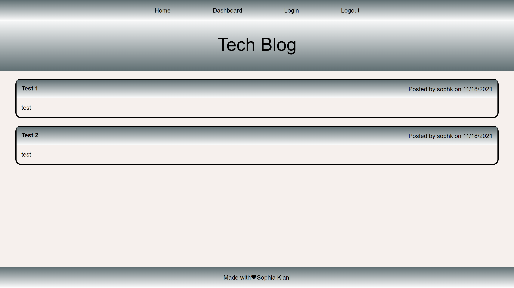

# Tech Blog

[](https://opensource.org/licenses/MIT)


<p align="center">
    
    
</p>
<p align="center">
    
    
    
    
    
    
    
</p>
   

# Description
The Tech Blog application allows users to view blogs/posts from other user's, as well as, create, create, update and delete their own blog/post. 


## Table of Contents
- [Overview](#overview)
- [Authors](#authors)
- [Demo](#demo)
- [Preview](#preview)
- [Features](#features)
- [Installation](#installation)
- [Contribution](#contribution)


## Authors
 - Author: Sophia
 - GitHub: [soph-k](https://github.com/soph-k)
 - Version 1.1


## Demo
[Demo Heroku](https://sophk-tech-blog.herokuapp.com/)


## Preview



## Repo
[Repo](https://github.com/soph-k/track-workouts)


## Features
- CSS
- Javascript 
- Node.js 
  - Express
  - Handlebars
- MySQL


## Installation
Before using commands please be sure that NodeJS packages are installed. 
If not, run the following commands in the following order: 
```
npm i
```


## Usage
Once all of the files and packages are install.
Run your establish a connection to your MySQL workbench 
and run the code below to use on your local host.

```
node server.js
```


## Contribution
Contributions are accepted. Feel free to fork without permission.


## License
This project is under the MIT license.


### Questions
For questions about this project, please review my GitHub repo at [soph-k](https://github.com/soph-k) or contact me on Github.


#### Bugs 
- No known bugs.

